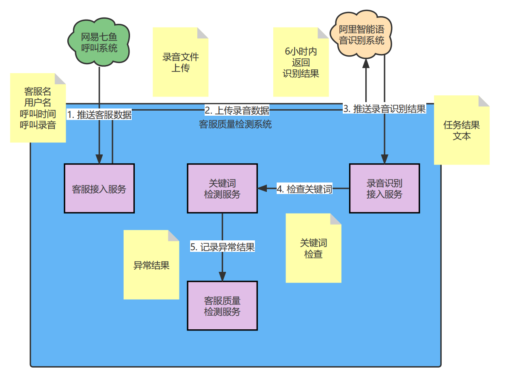

# 客服质量评估服务

## 需求列表

### 1.七鱼客服，取得客服记录

- 客服ID
- 客服名称
- 客户名称
- 呼出手机号
- 呼入手机号
- 录音文件地址

### 2.语音转文本（录音转换文本）

- 任务ID
- 转换时间
- 语句
- 关联客服记录

### 3.词库

- 关键词
- 关键词类型（敏感词）

### 4.识别关键字

- 触发的敏感词
- 关联的客服记录
- 关联的语音文本

### 5.敏感记录查询

- 人工二次筛查是否违规（选择）
- NLP（成本过高，且不能满足多句上下文语义）

## 技术文档

- [技术选型文档](doc/design/technology-selection.md)
- [客服系统相关文档](doc/design/qiyu-tech.md)
- [语音识别系统相关文档](doc/design/tech-doc.md)
- [技术需求文档](doc/design/requirement.md)
- [设计文档](doc/design/design.md)
- [数据库文档](doc/sql/service_quanlity.sql)

## 接口设计文档

描述|文档
---|---
-客户服务记录|[customer_service_record](doc/md/servicequanlity/CustomerServiceRecord.md)
-关键词检查记录|[keyword_check_record](doc/md/servicequanlity/KeywordCheckRecord.md)
-关键词字典|[keyword_map](doc/md/servicequanlity/KeywordMap.md)
-语句识别结果|[sentence_result](doc/md/servicequanlity/SentenceResult.md)
-语音识别任务表|[sound_to_text_task](doc/md/servicequanlity/SoundToTextTask.md)

