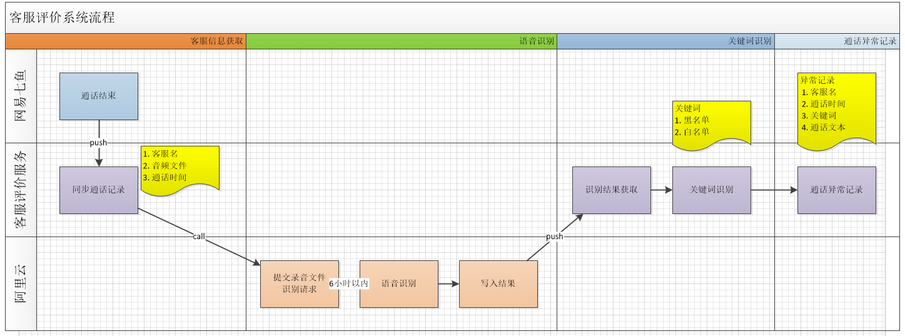
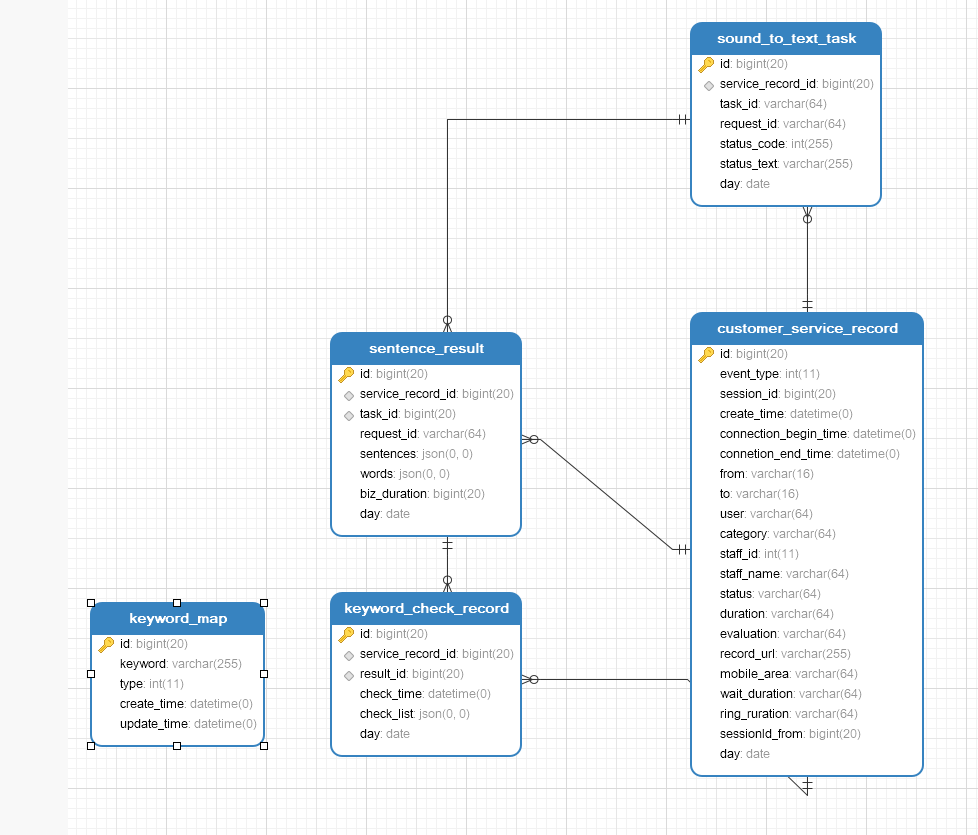
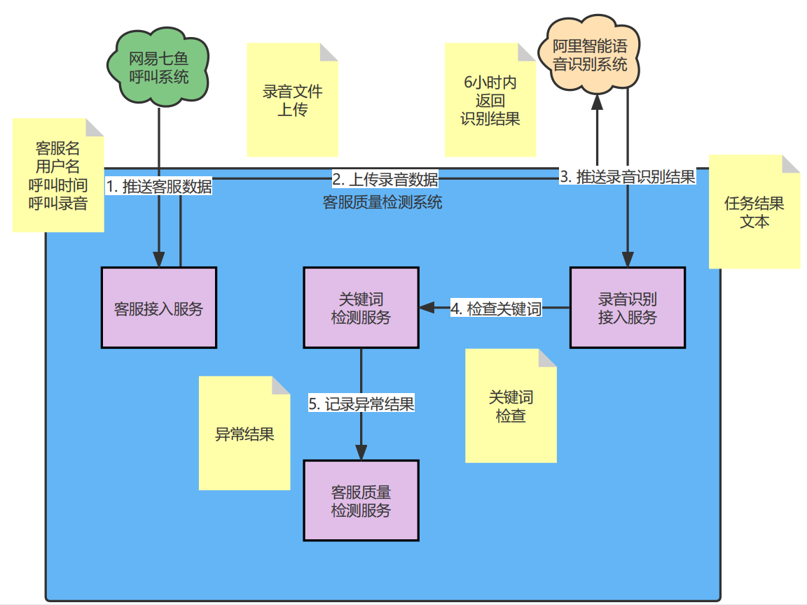

# 客户服务质量检测 - 设计文档

## 流程图
系统由以下4个阶段组成
- 客服信息获取阶段
  
      客服在语音通话结束后，七鱼系统推送通话记录给系统

- 语音识别阶段
  
      系统提交录音文件给阿里云语音识别系统，
      阿里云将在六小时返回文本信息给系统
  
- 关键词识别阶段

      系统经过关键词识别，找到符合检查条件的通话记录

- 通话异常记录阶段

      记录异常记录到系统中，供二次人为核实通话异常



## 数据库设计
数据库由下边留张表组成
- customer_service_record
  
      客户服务记录表，记录了客户服务的信息，包括客户信息，客服信息，通话的录音地址
  
- sound_to_text_task

      声音识别任务表，提交到阿里平台的任务记录，由于识别是一个需要花费较长时间（6小时内）
      才可以返回结果的延时计算，所以需要记录来检查任务的执行状态

- sentence_result

      识别的文本结果表，包含了语音文件的识别文本，还包含了一些其他的对话信息

- keyword_map

      关键词字典表，记录了要作为检查的关键词

- keyword_check_record、

      关键词检查结果，包括了异常的记录



## 系统构件图
系统包括以下组件：

- 七鱼呼叫系统

      用于提供客服呼叫系统的功能，并提供推送客服信息的功能
  
- 阿里智能语音识别系统
  
      提供了语音识别服务

- 客服接入服务
      
      作为七鱼系统的接入服务，接受并记录客服信息

- 录音识别接入服务
    
      作为阿里语音识别服务接入服务，上传录音文件，并等待识别结果的推送
  
- 关键词检查服务

      检查客服文本信息的关键词，查找符合条件的记录，并记录

- 客服质量检测服务

      读取记录，呈现给用户



## 接口设计

### 1.七鱼客服回调接口 web_hook API
提供给七鱼客服“同步通话记录”功能的回调接口， 用于获取七鱼客户服务结束时推送的信息，其中包括了通话录音文件地址

- 请求参数：
```aidl
curl -X POST \
  'http://www.xxx.com/api/ivr/crminfo?checksum=f570a5eb049eb803b086e45829b07e48&time=1511832531' \
  -H 'content-type: application/json;charset=utf-8' \
  -d '{
    "eventtype": 5,
    "sessionid": 216629286,
    "direction": "呼入",
    "createtime": 1511832411968,
    "connectionbeginetime": 1511832413992,
    "connectionendtime": 1511832432183,
    "from": "15854582215",
    "to": "05718690766",
    "user": "客户名称",
    "category": "售后问题/退货", //咨询分类
    "staffid": 642656,
    "staffname": "丽娜",
    "status": "接通", //会话状态
    "visittimes": 1, //重复咨询次数
    "duration": "10:15", //通话时长
    "evaluation": "满意", //满意度评价
    "recordurl": "https://ysf.nosdn.127.net/9f670ff01dae290ad4bf83401d291069.wav", //通话录音文件地址
    "overflowFrom": "溢出来源",
    "shuntGroupName"："分流客服组",
    "ivrPath":"ivr路径",
    "mobileArea":"号码归属地",
    "waitDuration":"5分10秒",  //排队等待时长
    "ringDuration":"1小时10分",   //振铃时长
    "sessionIdFrom": 216629286,   //转接至该会话的上一通会话id
  }'

```

- 参数说明

名称|类型|说明|示例
---|---|---|---
eventtype|Integer|事件类型|5
sessionid|Long|会话ID|216629286
direction|String|呼叫方向|呼入
createtime|Date|创建时间|1511832411968
connectionbeginetime|Date|连接开始时间|1511832413992
connectionendtime|Date|连接结束时间|1511832432183
from|String|呼叫方|15854582215
to|String|接收方|05718690766
user|String|客户名称|张三
category|String|资讯分类|售后问题/退货
staffid|Integer|员工id|642656
staffname|String|员工姓名|丽娜
status|String|会话状态|接通
visittimes|Integer|重复咨询次数|1
duration|String|通话时长|10:15
evaluation|String|满意度|满意
record_url|String|通话录音文件地址|https://ysf.nosdn.127.net/9f670ff01dae290ad4bf83401d291069.wav
overflowFrom|String|溢出来源|
shuntGroupName|String|分流客服组|
ivrPath|String|ivr路径|
mobileArea|String|号码归属地|
waitDuration|String|排队等待时长|5分10秒
ringDuration|String|振铃时长|1小时10分
sessionIdFrom|Long|转接的上一通会话ID|216629286


