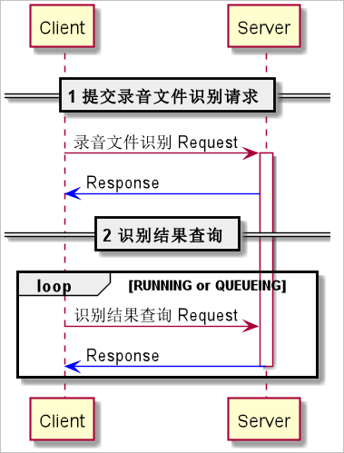

# 技术文档

## 识别特点
1. 双音轨，有可能可以区分开不同的人(左边是客户的，右边是客服的)
2. 普通话识别效率比较好，断句较为合理
3. 关键字的查询较为困难，甚至 NLP 也无法做到很好的多句上下文语义猜测。而且NPL费用将会很大

- 识别语义：过期认证有罚款


- 识别语义：提醒证书到期，未介绍会员产品


## 接口定义和说明

录音文件识别 sdk: https://help.aliyun.com/document_detail/90726.html

## 限制
1. 录音文件识别是非实时的，识别的文件需要提交基于HTTP可访问的URL地址，不支持提交本地文件。
2. 支持单轨和双轨的.wav、.mp3、.m4a、.wma、.aac、.ogg、.amr、.flac格式录音文件识别。
3. 文件大小不超过512 MB
4. 需要识别的录音文件必须存放在某服务上，可以通过URL访问。
5. 上传的录音文件URL的访问权限需要设置为公开，URL中只能使用域名不能使用IP地址、不可包含空格，请尽量避免使用中文。
6. 录音文件识别属于离线识别服务，对于并发数没有限制，对于QPS（Queries Per Second）的限制如下：
```
   POST方式的录音文件识别请求调用接口，用户级别QPS限制为200。
   GET方式的录音文件识别结果查询接口，用户级别QPS限制为500。
```
7. 付费用户的识别任务在6小时内完成并返回识别文本。识别结果在服务端可保存72小时。
   一次性上传大规模数据（半小时内上传超过500小时时长的录音）的除外。有大规模数据识别需求的用户，请联系售前专家。
8. 智能分轨功能只支持8k单通道的语音。
9. 支持调用方式：轮询方式和回调方式。
10. 支持语言模型定制。更多信息请参见语言模型定制。
11. 支持热词。更多信息请参见热词。(根据具体需求，主要支持名词和业务专属)
12. 支持汉语普通话、方言、欧美英语等多种模型识别。查看支持的方言和语种，请参见语音识别服务支持的方言模型和语种都有哪些？

## 使用步骤
1. 了解您的录音文件格式和采样率，根据业务场景在管控台选择合适的场景模型。
2. 将录音文件存放至OSS。
```aidl
如果OSS中文件访问权限为公开，可参见公共读Object，获取文件访问链接；
如果OSS中文件访问权限为私有，可参见私有Object，通过SDK生成有有效时间的访问链接。
您也可以把录音文件存放在自行搭建的文件服务器，提供文件下载。
请保证HTTP的响应头（Header）中Content-Length的长度值和Body中数据的真实长度一致，
否则会导致下载失败。
```
3. 客户端提交录音文件识别请求。
    正常情况下，服务端返回该请求任务的ID，用以查询识别结果。
4. 客户端发送识别结果查询请求。
    通过步骤3获取的请求任务ID查询录音文件识别的结果，目前识别的结果在服务端可保存72小时。
   
## 交互流程



```aidl
所有服务端的响应都会在返回信息的header包含表示本次识别任务的TaskId参数，请记录该值。
如果发生错误，请将该值和错误信息提交到工单。
```

## 接口调用方式
录音文件识别服务是以RPC风格的POP API方式提供录音文件识别接口，将参数封装到每一个请求中，每个请求即对应一个方法，执行的结果放在response中。需要识别的录音文件必须存放在某服务上（推荐阿里云OSS），可以通过URL访问。

录音文件识别POP API包括两部分：POST方式的“录音文件识别请求调用接口”（用户级别QPS（queries per second）限制为200）、GET方式的“录音文件识别结果查询接口”（用户级别QPS限制为500）。

### 识别请求调用接口：

- 当采用轮询方式时，提交录音文件识别任务，获取任务ID，供后续轮询使用。
- 当采用回调方式时，提交录音文件识别任务和回调URL，任务完成后会把识别结果POST到回调地址，要求回调地址可接收POST请求。

### 输入参数及说明：
提交录音文件识别请求时，需要设置输入参数，以JSON格式的字符串传入请求对象的Body，JSON格式如下：

```aidl
{
    "appkey": "your-appkey",
    "file_link": "https://gw.alipayobjects.com/os/bmw-prod/0574ee2e-f494-45a5-820f-63aee583045a.wav",
    "auto_split":false,
    "version": "4.0",
    "enable_words": false,
    "enable_sample_rate_adaptive": true,
    // valid_times：获取语音指定时间段的识别内容，若不需要，则无需填写。
    "valid_times": [
        {
            "begin_time": 200,
            "end_time":2000,
            "channel_id": 0
        }
    ]
}
```

参数|值类型|是否必选|说明
---|---|---|---
appkey	|	String	|	是	|	管控台的项目Appkey。
file_link	|	String	|	是	|	存放录音文件的地址，需要在管控台中将对应项目的模型设置为支持该音频场景的模型。
version	|	String	|	是	|	设置录音文件识别服务的版本，请设置为“4.0”，默认为“2.0”。
enable_words	|	Boolean	|	否	|	是否开启返回词信息，默认为false，开启时需要设置version为“4.0”。
enable_sample_rate_adaptive	|	Boolean	|	否	|	是否将大于16kHz采样率的音频进行自动降采样（降为16kHz），默认为false，开启时需要设置version为“4.0”。
enable_callback	|	Boolean	|	否	|	是否启用回调功能，默认值为false。
callback_url	|	String	|	否	|	回调服务的地址，enable_callback取值为true时，本字段必选。URL支持HTTP和HTTPS协议，host不可使用IP地址。
auto_split	|	Boolean	|	否	|	是否开启智能分轨（开启智能分轨，即可在两方对话的语音情景下，依据每句话识别结果中的ChannelId，判断该句话的发言人为哪一方。通常先发言一方ChanelId为0。只支持8000Hz采样率单通道语音）。
enable_inverse_text_normalization	|	Boolean	|	否	|	是否打开ITN，中文数字将转为阿拉伯数字输出，默认值为false，开启时需要设置version为“4.0”。
enable_disfluency	|	Boolean	|	否	|	是否打开声音顺滑，默认值false，开启时需要设置version为“4.0”。
enable_punctuation_prediction	|	Boolean	|	否	|	是否给句子加标点。默认值true（加标点）。
valid_times	|	List< ValidTime >	|	否	|	有效时间段信息，用来排除一些不需要的时间段。
max_end_silence	|	Integer	|	否	|	允许的最大结束静音，默认值450，单位是毫秒。
max_single_segment_time	|	Integer	|	否	|	允许单句话最大结束时间，最小值5000，默认值14000。单位是毫秒。
customization_id	|	String	|	否	|	通过POP API创建的定制模型ID，默认不添加。
class_vocabulary_id	|	String	|	否	|	创建的类热词表ID，默认不添加。
vocabulary_id	|	String	|	否	|	创建的泛热词表ID，默认不添加。
enable_semantic_sentence_detection	|	Boolean	|	否	|	是否启⽤语义断句，取值：true/false，默认值false。
enable_timestamp_alignment	|	Boolean	|	否	|	是否启用时间戳校准功能，取值：true/false，默认值false。
first_channel_only	|	Boolean	|	否	|	是否只识别首个声道，取值：true/false，默认值false（不开启）。

其中，ValidTime对象参数说明如下表所示。

参数	|	值类型	|	是否必选	|	说明
---	|	---	|	---	|	---
begin_time	|	Int	|	是	|	有效时间段的起始点时间偏移（单位：ms）。
end_time	|	Int	|	是	|	有效时间段的结束点时间偏移（单位：ms）。
channel_id	|	Int	|	是	|	有效时间段的作用音轨序号（从0开始）。

### 输出参数及说明：

服务端返回录音文件识别请求的响应，响应的输出参数为JSON格式的字符串：

```aidl
{
"TaskId": "4b56f0c4b7e611e88f34c33c2a60****",
"RequestId": "E4B183CC-6CFE-411E-A547-D877F7BD****",
"StatusText": "SUCCESS",
"StatusCode": 21050000
}
```

返回HTTP状态：200表示成功，更多状态码请查阅HTTP状态码。

属性	|	值类型	|	是否必选	|	说明
---	|	---	|	---	|	---
TaskId	|	String	|	是	|	识别任务ID。
RequestId	|	String	|	是	|	请求ID，仅用于联调。
StatusCode	|	Int	|	是	|	状态码。
StatusText	|	String	|	是	|	状态说明。

## 识别结果查询接口：

提交完录音文件识别请求后，按照如下参数设置轮询识别结果。

输入参数：

通过提交录音文件识别请求获得的任务ID作为识别结果查询接口参数，获取识别结果。在接口调用过程中，需要设置一定的查询时间间隔。

注意

```aidl
查询接口有QPS限制（100QPS），超过QPS之后则可能报错：
Throttling.User : Request was denied due to user flow control.。
建议查询接口的轮询间隔时长适当延长，不宜过短。
```
属性| 值类型 |是否必选 |说明
---|---|---|---
TaskId|String|是|识别任务ID。

输出参数及说明：

服务端返回识别结果查询请求的响应，响应的输出参数为JSON格式的字符串。
```aidl
    正常返回：以录音文件nls-sample-16k.wav（文件为单轨）识别结果为例。
```
```aidl
{
        "TaskId": "d429dd7dd75711e89305ab6170fe****",
        "RequestId": "9240D669-6485-4DCC-896A-F8B31F94****",
        "StatusText": "SUCCESS",
        "BizDuration": 2956,
        "SolveTime": 1540363288472,
        "StatusCode": 21050000,
        "Result": {
                "Sentences": [{
                        "EndTime": 2365,
                        "SilenceDuration": 0,
                        "BeginTime": 340,
                        "Text": "北京的天气。",
                        "ChannelId": 0,
                        "SpeechRate": 177,
                        "EmotionValue": 5.0
                }]
        }
}
```

如果开启enable_callback/callback_url，且设置服务版本为4.0，回调识别结果为：

```aidl
{
        "Result": {
                "Sentences": [{
                        "EndTime": 2365,
                        "SilenceDuration": 0,
                        "BeginTime": 340,
                        "Text": "北京的天气。",
                        "ChannelId": 0,
                        "SpeechRate": 177,
                        "EmotionValue": 5.0
                }]
        },
        "TaskId": "36d01b244ad811e9952db7bb7ed2****",
        "StatusCode": 21050000,
        "StatusText": "SUCCESS",
        "RequestTime": 1553062810452,
        "SolveTime": 1553062810831,
        "BizDuration": 2956
}
```

```aidl
说明

    RequestTime为时间戳（单位为毫秒，例如1553062810452转换为北京时间为2019/3/20 14:20:10），
    表示录音文件识别提交请求的时间。
    SolveTime为时间戳（单位为毫秒），表示录音文件识别完成的时间。
```
- 排队中：
```aidl
{
        "TaskId": "c7274235b7e611e88f34c33c2a60****",
        "RequestId": "981AD922-0655-46B0-8C6A-5C836822****",
        "StatusText": "QUEUEING",
        "StatusCode": 21050002
}
```

- 识别中：
```aidl
{
        "TaskId": "c7274235b7e611e88f34c33c2a60****",
        "RequestId": "8E908ED2-867F-457E-82BF-4756194A****",
        "StatusText": "RUNNING",
        "BizDuration": 0,
        "StatusCode": 21050001
}
```

- 异常返回：以文件下载失败为例。
```aidl
{
        "TaskId": "4cf25b7eb7e711e88f34c33c2a60****",
        "RequestId": "098BF27C-4CBA-45FF-BD11-3F532F26****",
        "StatusText": "FILE_DOWNLOAD_FAILED",
        "BizDuration": 0,
        "SolveTime": 1536906469146,
        "StatusCode": 41050002
}
```

```aidl
说明

更多异常情况请查看下面的服务状态码的错误状态码及解决方案。
```

## 返回HTTP状态：
200表示成功，更多状态码请查阅HTTP状态码。

属性	|	值类型	|	是否必选	|	说明
---	|	---	|	---	|	---
TaskId	|	String	|	是	|	识别任务ID。
StatusCode	|	Int	|	是	|	状态码。
StatusText	|	String	|	是	|	状态说明。
RequestId	|	String	|	是	|	请求ID，用于调试。
Result	|	Object	|	是	|	识别结果对象。
Sentences	|	List< SentenceResult >	|	是	|	识别的结果数据。当StatuxText为SUCCEED时存在。
Words	|	List< WordResult >	|	否	|	词信息，获取时需设置enable_words为true，且设置服务version为”4.0”。
BizDuration	|	Long	|	是	|	识别的音频文件总时长，单位为毫秒。
SolveTime	|	Long	|	是	|	时间戳，单位为毫秒，录音文件识别完成的时间。

其中，单句结果SentenceResult参数如下。

属性	|	值类型	|	是否必选	|	说明
---	|	---	|	---	|	---
ChannelId	|	Int	|	是	|	该句所属音轨ID。
BeginTime	|	Int	|	是	|	该句的起始时间偏移，单位为毫秒。
EndTime	|	Int	|	是	|	该句的结束时间偏移，单位为毫秒。
Text	|	String	|	是	|	该句的识别文本结果。
EmotionValue	|	Int	|	是	|	情绪能量值，取值为音量分贝值/10。取值范围：[1,10]。值越高情绪越强烈。
SilenceDuration	|	Int	|	是	|	本句与上一句之间的静音时长，单位为秒。
SpeechRate	|	Int	|	是	|	本句的平均语速，单位：字数/分钟。

- 开启返回词信息：

```aidl
如果enable_words设置为true，且设置服务version为"4.0"，服务端的识别结果将包含词信息。
使用轮询方式和回调方式获得的词信息相同，以轮询方式的识别结果为例：
```

```aidl
{
        "StatusCode": 21050000,
        "Result": {
                "Sentences": [{
                        "SilenceDuration": 0,
                        "EmotionValue": 5.0,
                        "ChannelId": 0,
                        "Text": "北京的天气。",
                        "BeginTime": 340,
                        "EndTime": 2365,
                        "SpeechRate": 177
                }],
                "Words": [{
                        "ChannelId": 0,
                        "Word": "北京",
                        "BeginTime": 640,
                        "EndTime": 940
                }, {
                        "ChannelId": 0,
                        "Word": "的",
                        "BeginTime": 940,
                        "EndTime": 1120
                }, {
                        "ChannelId": 0,
                        "Word": "天气",
                        "BeginTime": 1120,
                        "EndTime": 2020
                }]
        },
        "SolveTime": 1553236968873,
        "StatusText": "SUCCESS",
        "RequestId": "027B126B-4AC8-4C98-9FEC-A031158F****",
        "TaskId": "b505e78c4c6d11e9a213e11db149****",
        "BizDuration": 2956
}
```
- Word对象说明：

属性	|	值类型	|	是否必选	|	说明
---	|	---	|	---	|	---
BeginTime	|	Int	|	是	|	词开始时间，单位毫秒。
EndTime	|	Int	|	是	|	词结束时间，单位毫秒。
ChannelId	|	Int	|	是	|	该词所属音轨ID。
Word	|	String	|	是	|	词信息。

### 服务状态码

- 正常状态码

状态码	|	状态描述	|	状态含义	|	解决方案
---	|	---	|	---	|	---
21050000	|	SUCCESS	|	成功。	|	POST方式的识别请求接口调用成功，或者GET方式的识别结果查询接口调用成功。
21050001	|	RUNNING	|	录音文件识别任务运行中。	|	请稍后再发送GET方式的识别结果查询请求。
21050002	|	QUEUEING	|	录音文件识别任务排队中。	|	请稍后再发送GET方式的识别结果查询请求。
21050003	|	SUCCESS_WITH_NO_VALID_FRAGMENT	|	识别结果查询接口调用成功，但是没有识别到语音。	|	检查录音文件是否有语音，或者语音时长太短。

- 错误状态码

```aidl
说明
状态码以“4”开头表示客户端错误，以“5”开头表示服务端错误。
```

状态码	|	描述	|	含义	|	解决方案
---	|	---	|	---	|	---
41050001	|	USER_BIZDURATION_QUOTA_EXCEED	|	单日时间超限（免费用户每日可识别不超过2小时时长的录音文件）。	|	建议从免费版升级到商用版。如业务量较大，请联系商务洽谈，邮件地址：nls_support@service.aliyun.com。
41050002	|	FILE_DOWNLOAD_FAILED	|	文件下载失败。	|	检查录音文件路径是否正确，是否可以外网访问和下载。
41050003	|	FILE_CHECK_FAILED	|	文件格式错误。	|	检查录音文件是否是单轨/双轨的WAV格式、MP3格式。
41050004	|	FILE_TOO_LARGE	|	文件过大。	|	检查录音文件大小是否超过512 MB。
41050005	|	FILE_NORMALIZE_FAILED	|	文件归一化失败。	|	检查录音文件是否有损坏，是否可以正常播放。
41050006	|	FILE_PARSE_FAILED	|	文件解析失败。	|	检查录音文件是否有损坏，是否可以正常播放。
41050007	|	MKV_PARSE_FAILED	|	MKV解析失败。	|	检查录音文件是否有损坏，是否可以正常播放。
41050008	|	UNSUPPORTED_SAMPLE_RATE	|	采样率不匹配。	|	检查实际语音的采样率和控制台上Appkey绑定的ASR模型采样率是否一致，或者将本篇文档中自动降采样的参数enable_sample_rate_adaptive设置为true。
41050009	|	UNSUPPORTED_ASR_GROUP	|	ASR分组不支持。	|	确认请求参数appkey值是否设置正确，或者是否与阿里云账号的AccessKey ID同一个账号。
41050010	|	FILE_TRANS_TASK_EXPIRED	|	录音文件识别任务过期。	|	TaskId不存在，或者已过期。
41050011	|	REQUEST_INVALID_FILE_URL_VALUE	|	请求file_link参数非法。	|	确认file_link参数格式是否正确。
41050012	|	REQUEST_INVALID_CALLBACK_VALUE	|	请求callback_url参数非法。	|	确认callback_url参数格式是否正确，是否为空。
41050013	|	REQUEST_PARAMETER_INVALID	|	请求参数无效。	|	确认请求task值为有效JSON格式字符串。
41050014	|	REQUEST_EMPTY_APPKEY_VALUE	|	请求参数appkey值为空。	|	确认是否设置了appkey参数值。
41050015	|	REQUEST_APPKEY_UNREGISTERED	|	请求参数appkey未注册。	|	确认请求参数appkey值是否设置正确，或者是否与阿里云账号的AccessKey ID同一个账号。
41050021	|	RAM_CHECK_FAILED	|	RAM检查失败。	|	检查您的RAM用户是否已经授权调用语音服务的API，请参见RAM用户权限配置。
41050023	|	CONTENT_LENGTH_CHECK_FAILED	|	content-length 检查失败。	|	检查下载文件时，HTTP response中的content-length与文件实际大小是否一致。
41050024	|	FILE_404_NOT_FOUND	|	需要下载的文件不存在。	|	检查需要下载的文件是否存在。
41050025	|	FILE_403_FORBIDDEN	|	没有权限下载需要的文件。	|	检查是否有权限下载录音文件。
41050026	|	FILE_SERVER_ERROR	|	请求的文件所在的服务不可用。	|	检查请求的文件所在的服务是否可用。
41050029	|	ASR_RESPONSE_HAVE_HO_WORDS	|	未识别出有效文字。	|	检查音频内容。
50000000	|	INTERNAL_ERROR	|	默认的服务端错误。	|	如果偶现可以忽略，重复出现请提交工单。
51050000	|	INTERNAL_ERROR	|	内部通用错误。	|	如果偶现可以忽略，重复出现请提交工单。
51050001	|	VAD_FAILED	|	VAD失败。	|	如果偶现可以忽略，重复出现请提交工单。
51050002	|	RECOGNIZE_FAILED	|	内部alisr识别失败。	|	如果偶现可以忽略，重复出现请提交工单。
51050003	|	RECOGNIZE_INTERRUPT	|	内部alisr识别中断。	|	如果偶现可以忽略，重复出现请提交工单。
51050004	|	OFFER_INTERRUPT	|	内部写入队列中断。	|	如果偶现可以忽略，重复出现请提交工单。
51050005	|	FILE_TRANS_TIMEOUT	|	内部整体超时失败。	|	如果偶现可以忽略，重复出现请提交工单。
51050006	|	FRAGMENT_FAILED	|	内部分断失败。	|	如果偶现可以忽略，重复出现请提交工单。

### 历史版本说明

如果您已接入录音文件识别，即没有设置服务版本为4.0，将默认使用录音文件识别2.0版本。回调方式的识别结果与轮询方式的识别结果在JSON字符串的风格和字段上有所不同， 如果开启enable_callback/callback_url，回调识别结果为：

```aidl
{
        "result": [{
                "begin_time": 340,
                "channel_id": 0,
                "emotion_value": 5.0,
                "end_time": 2365,
                "silence_duration": 0,
                "speech_rate": 177,
                "text": "北京的天气。"
        }],
        "task_id": "3f5d4c0c399511e98dc025f34473****",
        "status_code": 21050000,
        "status_text": "SUCCESS",
        "request_time": 1551164878830,
        "solve_time": 1551164879230,
        "biz_duration": 2956
}
```


