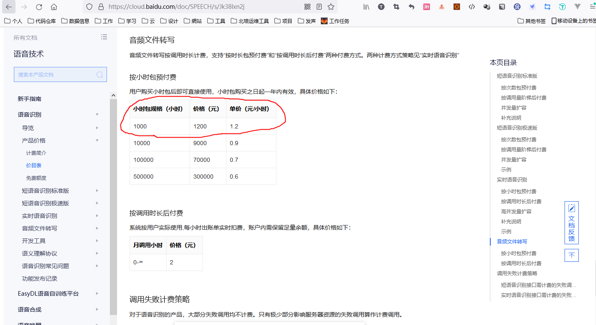
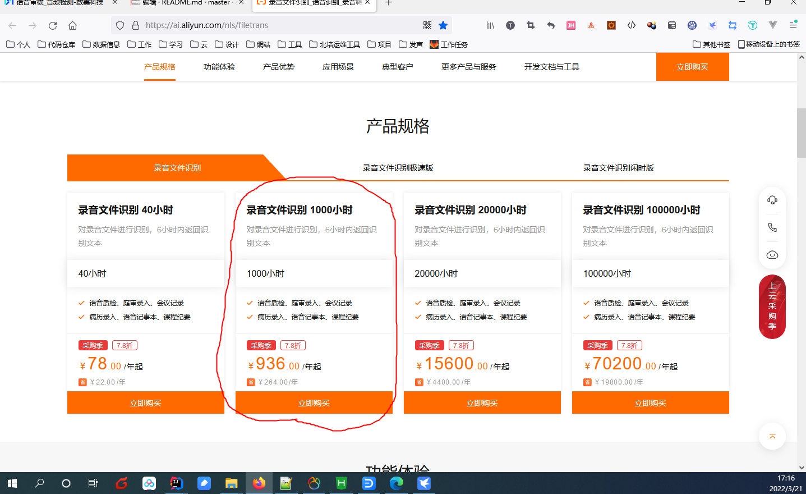
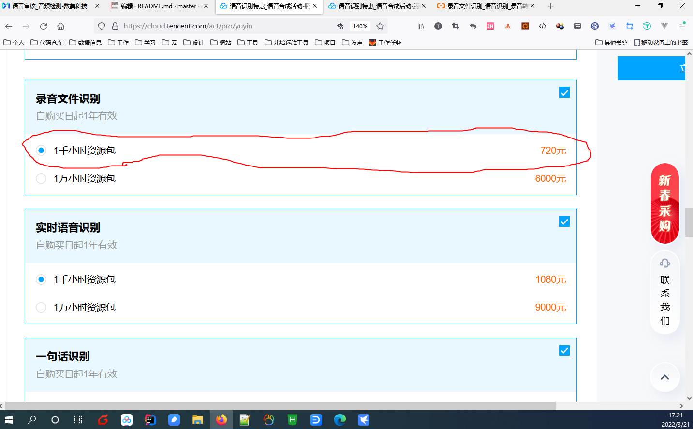
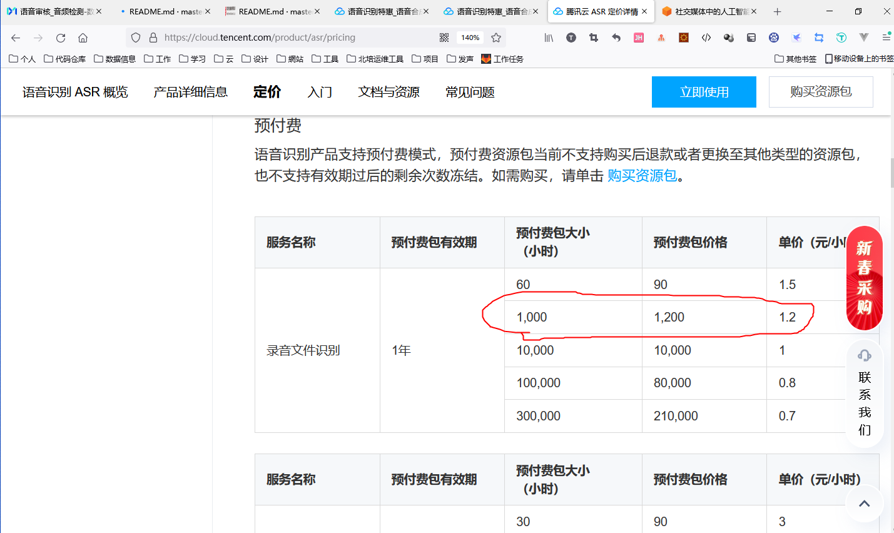

# 技术选型

## 原始需求
1. 从七鱼系统获取客服录音文件
2. 识别录音中的文字内容（仅普通话）
3. 按关键字识别敏感词语
4. 收集违反敏感词的对话信息
5. 敏感词对应到人员、时间和具体文本
6. 预测：200小时/月，2400小时/年
7. 每天多个小文件（平均3-5分钟）
8. 延时处理

## 问题（需要等待需求人员确认）
1. 每次通话的限制
2. 相对更准确的时间和使用场景
2. 样子录音文件（格式、清晰度）
3. 文件名
4. 其他数据来源（操作用户等）
5. 是否录音中包含用户声音

## 需求调研
1. 应该说的话
2. 不该说的话
3. 用词的质量
4. 客户的满意度（？）
5. 回答时长，文本，人员，文件记录

## 技术调研
1. STT 系统，费用，特性
- 科大讯飞：
  语音转写：https://www.xfyun.cn/services/lfasr

按照每月200小时，一年2400小时计算，需要购买每年 10500档位

- 百度云：
  音频转写：https://cloud.baidu.com/product/speech/aasr

按照每月200小时，一年2400小时计算，需要购买2次1200档位，加上400小时后付费 400*2=800
总共花费 3200元

- 阿里云：
  录音文件识别：https://ai.aliyun.com/nls/filetrans

按照每月200小时，一年2400小时计算，需要购买3次936档位，2808元

- 腾讯云：

语音识别：https://cloud.tencent.com/act/pro/yuyin

按照每月200小时，一年2400小时计算，需要购买1次特价720档位和两次1200档位，3120元

技术选型，考虑腾讯裁员比较重，腾讯云在腾讯集团内重要程度不如阿里云在阿里集团的地位。
技术选型阿里云（3000小时的话，相对也最便宜）

2. 七鱼平台接入